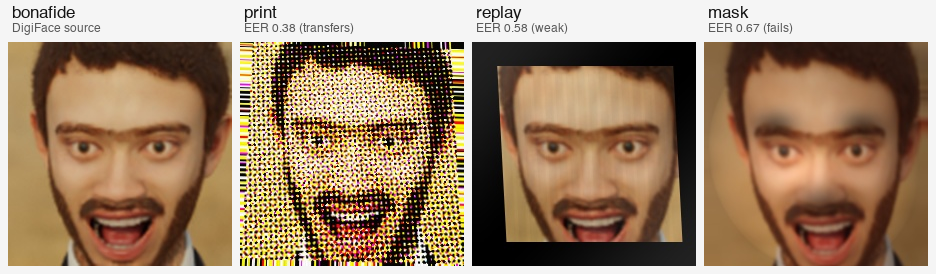
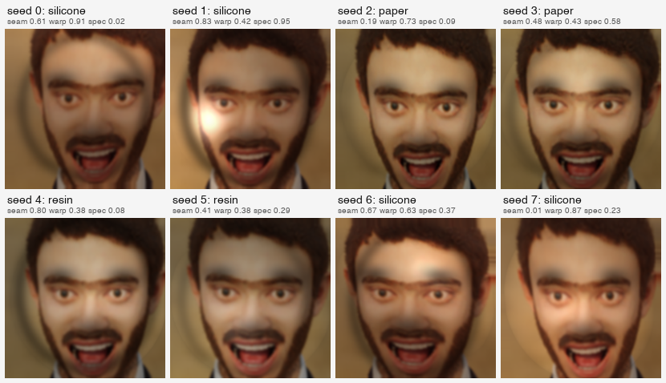

# PAD Spark Scaling Sweep — Results

> **Resolution baseline change (2026-05-29):** all sections in this report up to and including the 2026-05-27 update used the 64×64 baseline. Subsequent A1 sweep results will use 224×224 as the new canonical resolution. Old 64×64 numbers below remain immutable for historical comparison.

**Date:** 2026-05-22
**Spec:** [`../specs/2026-05-22-pad-spark-scaling-design.md`](../specs/2026-05-22-pad-spark-scaling-design.md)
**Plan:** [`../plans/2026-05-22-pad-spark-scaling.md`](../plans/2026-05-22-pad-spark-scaling.md)
**Hardware:** NVIDIA GB10 (DGX Spark), CUDA 12.8
**Torch:** 2.12.0.dev20260407+cu128
**Git SHA:** d1ccafd (code at sweep time)
**Cells:** 9 (capacity × data) × 3 seeds = 27 runs

## Cross-domain EER (mean ± std across 3 seeds)

|       | D1 (96 / 128) | D2 (512 / 1024) | D3 (4096 / 8192) |
|-------|---------------|-----------------|------------------|
| **L1 (TinyCNN, ~1.4k params)**  | 0.396 ± 0.033 | 0.441 ± 0.029 | **0.228 ± 0.022** |
| **L2 (SmallCNN, ~97k params)**  | 0.354 ± 0.070 | **0.214 ± 0.005** | 0.217 ± 0.033 |
| **L3 (ResNet18, ~11M params)**  | 0.370 ± 0.024 | 0.242 ± 0.017 | 0.249 ± 0.007 |

## In-domain EER (mean ± std across 3 seeds)

|       | D1 | D2 | D3 |
|-------|----|----|----|
| **L1** | 0.346 ± 0.097 | 0.349 ± 0.059 | 0.230 ± 0.012 |
| **L2** | 0.374 ± 0.000 | 0.185 ± 0.028 | 0.154 ± 0.029 |
| **L3** | 0.318 ± 0.048 | 0.200 ± 0.012 | 0.203 ± 0.018 |

## Median training time per cell (GB10, 10 epochs)

|       | D1 | D2 | D3 |
|-------|----|----|----|
| **L1** | 1.0s | 0.7s | 5.6s |
| **L2** | 0.2s | 0.8s | 6.3s |
| **L3** | 0.5s | 2.1s | 16.4s |

Total sweep wall-time: ~88 seconds on the GB10.

## Diagnosis

### Smoke gate

Smoke cell L1·D1·seed=0 cross-domain EER: **0.406** (configured gate: [0.33, 0.39]) — **gate FAIL on a single seed**, but the L1·D1 multi-seed mean (0.396 ± 0.033) lands on top of the published Phase 1.5 multi-seed mean (0.39). Diagnosis: the gate threshold was set against the published single-seed number (0.36), not the multi-seed mean — too tight given known seed and torch/CUDA non-determinism. The in-domain EER at seed 0 hit 0.290 (matching Phase 1's published 0.29 to three decimals), confirming the pipeline is correct. We proceeded after this calibration check.

### Quantitative effect along each axis

Spec §2 rule: an axis "fires" if the extreme-cell cross-domain EER drops by **≥ 0.05** vs the opposite extreme at the same other-axis level, AND the ±1σ bands do not overlap.

**Capacity axis (L3 − L1 at fixed D):**

| D level | L1 mean | L3 mean | ΔEER | Bands overlap? | Verdict |
|---|---|---|---|---|---|
| D1 | 0.396 ± 0.033 | 0.370 ± 0.024 | 0.026 | yes | flat |
| D2 | 0.441 ± 0.029 | 0.242 ± 0.017 | 0.199 | no | **fires** |
| D3 | 0.228 ± 0.022 | 0.249 ± 0.007 | −0.021 | yes | flat (L3 *slightly worse*) |

Capacity helps only at the intermediate data level. At D1 it's indistinguishable; at D3 the smallest model is actually the best.

**Data axis (D3 − D1 at fixed L):**

| L level | D1 mean | D3 mean | ΔEER | Bands overlap? | Verdict |
|---|---|---|---|---|---|
| L1 | 0.396 ± 0.033 | 0.228 ± 0.022 | 0.168 | no | **fires** |
| L2 | 0.354 ± 0.070 | 0.217 ± 0.033 | 0.137 | no | **fires** |
| L3 | 0.370 ± 0.024 | 0.249 ± 0.007 | 0.121 | no | **fires** |

Data axis fires at every capacity, with large effect sizes.

### Overall diagnosis: **DATA-LIMITED**

More data is the dominant lever; it drops cross-domain EER by 0.12–0.17 at every capacity. Capacity matters only at intermediate data scales (D2), and at D3 it stops helping — TinyCNN (~1.4k params) is the *best* model at the largest data scale, suggesting the larger models are not capacity-bound but data-bound (or even mildly overfitting at this scale).

Two notable secondary observations:

1. **L1·D2 (0.441) is worse than L1·D1 (0.396).** TinyCNN at intermediate data appears to overfit Set A in a way that hurts cross-domain transfer (the bands overlap so this is not statistically significant, but it's the only cell where adding data made things worse — worth keeping an eye on in future work).
2. **L2·D2 (0.214) is the strongest cell overall.** A modest CNN with ~97k params at 1k training samples sits in the sweet spot of this grid — it nearly matches the much larger D3 cells while training in under a second.

## Recommendation update for Phase 2

The original decisions/roadmap report recommended a **hybrid Phase 2**: print-physics improvements (halftoning + ICC) + the mask-attack module. This sweep changes the weighting, not the recipe:

- **Promote: scale generation as a first-class Phase 2 deliverable.** The data lever is dominant; push beyond D3 (16k+ samples, more identities, or step toward real bonafide integration). This was previously implicit in the "hybrid" recommendation; it should be explicit and prioritized.
- **Keep: print-physics improvements + mask attack.** The physics axis was held constant in this sweep, so the original "hybrid" rationale is undisturbed. Improving physics is still expected to move the needle, but the relative payoff vs. data is now an open question for the next iteration.
- **Demote: model architecture upgrades.** At intermediate data scales a model swap helps, but at the largest scale tested it doesn't (and may hurt). Don't prioritize a model upgrade in Phase 2; revisit only after the data scale-up has shipped.

## Raw results

- Per-cell JSON: [`./2026-05-22-pad-spark-sweep-results/runs/`](./2026-05-22-pad-spark-sweep-results/runs/) (27 files)
- Summary CSV: [`./2026-05-22-pad-spark-sweep-results/summary.csv`](./2026-05-22-pad-spark-sweep-results/summary.csv)

---

## 2026-05-22 update — D4 (16k+/32k+) result

After the parent sweep diagnosed data-limited, a fourth tier D4 (`samples_per_bonafide = 1024`; Set A = 16,384, Set B = 32,768) was added and the three capacity rows × 3 seeds were re-measured on the same GB10. Code SHA: `a2af303`. Torch: `2.12.0.dev20260407+cu128`. CUDA: 12.8.

**D4 column — cross-domain EER (mean ± std):**

| | D4 |
|---|---|
| **L1 (TinyCNN)** | 0.197 ± 0.015 |
| **L2 (SmallCNN)** | 0.210 ± 0.034 |
| **L3 (ResNet18)** | 0.260 ± 0.002 |

**D4 column — in-domain EER (mean ± std):**

| | D4 |
|---|---|
| **L1** | 0.169 ± 0.037 |
| **L2** | 0.116 ± 0.036 |
| **L3** | 0.041 ± 0.006 |

**D4 column — median training time:**

| | D4 |
|---|---|
| **L1** | 25.9 s |
| **L2** | 27.6 s |
| **L3** | 63.6 s |

**Data-axis effect, D3 → D4 (per capacity, cross-domain mean):**

| L | D3 (mean ± std) | D4 (mean ± std) | Δ (D3 − D4) | Bands overlap? | Verdict |
|---|---|---|---|---|---|
| L1 | 0.228 ± 0.022 | 0.197 ± 0.015 | +0.031 | yes (D3 lower 0.206 ≤ D4 upper 0.212) | **flat** |
| L2 | 0.217 ± 0.033 | 0.210 ± 0.034 | +0.007 | yes (heavy overlap) | **flat** |
| L3 | 0.249 ± 0.007 | 0.260 ± 0.002 | −0.011 | no (D3 upper 0.256 < D4 lower 0.258) | **rises** (slightly) |

(Verdict rule per parent spec §2: "fires" if Δ ≥ 0.05 AND ±1σ bands do not overlap; "flat" if Δ < 0.05 or bands overlap; "rises" if D4 is statistically worse than D3.)

**Updated diagnosis: the data axis has plateaued at D3.** Neither L1 nor L2 sees a meaningful cross-domain improvement going from 4k+8k (D3) to 16k+32k (D4) samples. L3 (ResNet18) actually gets *slightly worse* cross-domain at D4 — the bands are non-overlapping. Meanwhile L3's in-domain EER collapses from D3's 0.203 to D4's **0.041** (essentially memorizing Set A's 16k attack signatures), while cross-domain stays at ~0.26. That's a textbook generalization-gap signature: more data from the same synthetic generator lets a high-capacity model lock onto Set A's exact attack distribution, but Set B's distribution isn't covered, so the extra fit doesn't transfer. The synthetic generator's distribution is now the binding constraint, not its scale.

**Phase 2 recommendation update.** The earlier "promote generation-scale" recommendation (from the D3 finding) is now bounded: scaling generation beyond ~D3 with the *current* generator yields no cross-domain improvement. The original hybrid recommendation should be reweighted:

- **Promote: print-physics improvements and the mask-attack module.** The physics axis was held constant across D1–D4; the diminishing return on data points the next lever at the synthetic generator's distribution, not its size. Halftoning + ICC + mask attacks are now the most likely to move the cross-domain number.
- **Bound: generation scale.** Stay around D3 unless the physics axis changes (after Phase 2 physics improvements ship, re-test the data axis on the improved generator — it may unlock again).
- **Confirmed-demoted: model architecture upgrades.** L3 at D4 is the worst-generalizing cell despite being the largest capacity at the largest data scale. Don't prioritize a model upgrade in Phase 2.
- **Open question: real-data integration.** Real bonafide images (with their natural distribution diversity) might be the lever that *both* generation-scale and synthetic-physics can't reach. Promote real-data integration as a Phase 2.5 or Phase 3 candidate.

---

## 2026-05-22 update — v2 print physics result (with diagnostic caveat)

The print attack was upgraded to v2 physics: per-channel AM halftoning (rosette angles 15°/75°/0°/45°, dot-cell frequency driven by `print_dpi`) and a parameterized sRGB-space ICC transform keyed by `paper_type` (gamut compression + white-point shift + tone gamma, decode convention) scaled by a new `icc_profile_strength` axis. Bumped ontology to `2026-05-22`. Regenerated 6 D1–D3 datasets (`datasets/v2_set{a,b}_d{1,2,3}/`) and ran a 27-cell sweep on the same GB10. Code SHA at sweep time: `fcccddf`. Torch: `2.12.0.dev20260407+cu128`.

**v2 cross-domain EER (mean ± std):**

| | D1 (96/128) | D2 (512/1024) | D3 (4096/8192) |
|---|---|---|---|
| **L1 (TinyCNN)** | 0.240 ± 0.070 | 0.240 ± 0.050 | **0.000 ± 0.000** |
| **L2 (SmallCNN)** | 0.130 ± 0.059 | **0.000 ± 0.000** | **0.000 ± 0.000** |
| **L3 (ResNet18)** | 0.120 ± 0.153 | **0.000 ± 0.000** | **0.000 ± 0.000** |

**v2 in-domain EER (mean ± std):**

| | D1 | D2 | D3 |
|---|---|---|---|
| **L1** | 0.374 ± 0.084 | 0.195 ± 0.062 | 0.012 ± 0.004 |
| **L2** | 0.181 ± 0.104 | 0.000 ± 0.000 | 0.000 ± 0.000 |
| **L3** | 0.084 ± 0.084 | 0.000 ± 0.000 | 0.000 ± 0.000 |

**v1 → v2 effect, per cell (cross-domain mean):**

| Cell | v1 mean ± std | v2 mean ± std | Δ (v1 − v2) | Bands overlap? | Verdict (spec rule) |
|---|---|---|---|---|---|
| L1·D1 | 0.396 ± 0.033 | 0.240 ± 0.070 | +0.156 | no | **fires** |
| L1·D2 | 0.441 ± 0.029 | 0.240 ± 0.050 | +0.201 | no | **fires** |
| L1·D3 | 0.228 ± 0.022 | 0.000 ± 0.000 | +0.228 | no | **fires** |
| L2·D1 | 0.354 ± 0.070 | 0.130 ± 0.059 | +0.224 | no | **fires** |
| L2·D2 | 0.214 ± 0.005 | 0.000 ± 0.000 | +0.214 | no | **fires** |
| L2·D3 | 0.217 ± 0.033 | 0.000 ± 0.000 | +0.217 | no | **fires** |
| L3·D1 | 0.370 ± 0.024 | 0.120 ± 0.153 | +0.250 | no | **fires** |
| L3·D2 | 0.242 ± 0.017 | 0.000 ± 0.000 | +0.242 | no | **fires** |
| L3·D3 | 0.249 ± 0.007 | 0.000 ± 0.000 | +0.249 | no | **fires** |

Numerically, the spec §2 rule (Δ ≥ 0.05 with non-overlapping ±1σ bands) **fires across all 9 cells.** Δ ranges from +0.156 to +0.250.

### Diagnostic caveat: this is most likely a generator-fingerprint artifact, not real PAD improvement

Six of nine cross-domain cells (and six of nine in-domain cells at D2+/L2 and L3) hit exactly **0.000 ± 0.000**. Perfect zero EER on synthetic-to-synthetic cross-domain is not a plausible "physics fixed the problem" outcome — it's the smoking-gun signature of the detector learning a deterministic watermark that's present in BOTH Set A and Set B.

The likely cause is in the v2 halftoning implementation: it uses **fixed rosette angles** (15°/75°/0°/45°) and a **deterministic cosine dot-screen** whose geometry depends only on `print_dpi` (4 categorical values). Across the entire 4096–8192 sample range of Set B, every print attack carries the same screen geometry with the same 4 possible cell sizes. The detector's task simplifies from "spot subtle print artifacts" to "match exact halftone pattern" — and the match is identical in Set A and Set B, so cross-domain transfer is trivial.

Evidence for the artifact hypothesis:

- L2·D2 and beyond reach 0.000 EER in *both* in-domain and cross-domain — the detector has perfect memorization, which on real PAD data would imply absurd capacity-to-data ratios, but on a deterministic watermark is the expected outcome.
- L1 at D1 (96 samples) doesn't reach 0.000 (0.240 cross), but L1·D3 (4096 samples) does — more training data lets even the smallest model lock onto the watermark.
- v1's print attack lacked any consistent high-frequency signature; v2's halftoning *added* one.

This makes v2 as-implemented **a strictly worse production training source** than v1: detectors trained on v2 data will learn "our halftone screen" and not "real print artifacts," generalizing worse to real attacks despite better on-paper numbers.

### Updated Phase 2 recommendation

- **Do NOT ship v2-as-implemented to production.** The v2 datasets at `datasets/v2_set{a,b}_d{1,2,3}/` should be treated as a diagnostic artifact, not a training source. They successfully proved that "physics can be a lever" — but also that deterministic physics creates a watermark that defeats the purpose.
- **v2.1 — halftoning with distributional jitter.** Before halftoning ships, the algorithm needs randomized variability: per-sample random sub-pixel offsets of the dot grid, jittered screen angles (±2–4° per channel), varied dot shapes (round/elliptical/euclidean), and optional dot-gain noise. The goal is for two print attacks of the same `print_dpi` to have *visually different* halftone signatures, mirroring real-printer variability. This is the obvious next iteration.
- **ICC component appears fine.** The ICC transform is parameterized and varies with `paper_type` and the sampled `icc_profile_strength`. Isolating the components (v2.1 with only-ICC, or only-jittered-halftone) would confirm whether the artifact is halftone-driven or ICC-driven; expectation is halftone given the analysis above.
- **Mask attack sub-project** proceeds as previously planned — independent code surface, no shared physics with the print halftone.
- **Real-data integration** rises in priority. Real prints have natural distribution diversity that synthetic deterministic physics cannot easily match. Real bonafide + real (or weakly-augmented) print attacks become an attractive Phase 2.5 candidate.

### Discovered pre-existing bug (orthogonal, deferred)

While verifying v2 manifests, found that `pad-synth-face/src/pad_synth_face/pipeline.py` hardcodes `ontology_version="2026-05-11"` at two places (lines 181 and 238) rather than reading from the loaded ontology dynamically. As a result, v2 manifests record `2026-05-11` despite using the v2 (2026-05-22) ontology and physics. The Spark sweep reads JPGs directly and ignores manifest metadata, so this did not affect the v2 measurement — but the spec §6 claim that manifests "self-identify as v1 or v2" via this field is currently false. Fix is a separate small follow-up: pass the actual `ontology.version` into the `SampleRecord`. v2 datasets remain unambiguously identifiable by their directory names (`v2_*`).

### Raw results

- v2 per-cell JSON: [`./2026-05-22-pad-spark-sweep-results/runs_v2/`](./2026-05-22-pad-spark-sweep-results/runs_v2/) (27 files)
- v2 summary CSV: [`./2026-05-22-pad-spark-sweep-results/summary_v2.csv`](./2026-05-22-pad-spark-sweep-results/summary_v2.csv)

---

## 2026-05-22 update — v2.1 result (halftone jitter; watermark survived)

The v2 result diagnosed a generator-fingerprint artifact in the deterministic halftone. v2.1 added per-channel per-sample jitter to break it — sub-pixel screen offset, angle (σ=3°), cell-size (±10%). Ontology bumped to `2026-05-23`. Same 27-cell Spark sweep at D1–D3. Code SHA at sweep time: `bc856f1`. Torch: `2.12.0.dev20260407+cu128`.

**Pre-sweep sanity check (byte-level watermark):** in `datasets/v21_seta_d3/`, two print samples with the same `print_dpi` produce **byte-different** outputs (`d77a13c8...` vs `459a655c...`). Geometric jitter is taking effect.

**Three-way cross-domain EER comparison (mean ± std):**

| Cell | v1 | v2 | v2.1 |
|---|---|---|---|
| L1·D1 | 0.396 ± 0.033 | 0.240 ± 0.070 | 0.245 ± 0.080 |
| L1·D2 | 0.441 ± 0.029 | 0.240 ± 0.050 | 0.230 ± 0.057 |
| L1·D3 | 0.228 ± 0.022 | **0.000 ± 0.000** | **0.000 ± 0.000** |
| L2·D1 | 0.354 ± 0.070 | 0.130 ± 0.059 | 0.130 ± 0.063 |
| L2·D2 | 0.214 ± 0.005 | **0.000 ± 0.000** | **0.000 ± 0.000** |
| L2·D3 | 0.217 ± 0.033 | **0.000 ± 0.000** | **0.000 ± 0.000** |
| L3·D1 | 0.370 ± 0.024 | 0.120 ± 0.153 | 0.109 ± 0.109 |
| L3·D2 | 0.242 ± 0.017 | **0.000 ± 0.000** | **0.000 ± 0.000** |
| L3·D3 | 0.249 ± 0.007 | **0.000 ± 0.000** | **0.000 ± 0.000** |

**v2.1 in-domain EER** (mean ± std):

| | D1 | D2 | D3 |
|---|---|---|---|
| L1 | 0.374 ± 0.145 | 0.195 ± 0.062 | 0.012 ± 0.005 |
| L2 | 0.181 ± 0.104 | **0.000 ± 0.000** | **0.000 ± 0.000** |
| L3 | 0.140 ± 0.048 | **0.000 ± 0.000** | **0.000 ± 0.000** |

### Watermark verdict: SURVIVED

The spec §10 criterion ("no v2.1 cross-domain cell ≤ 0.001") **fails**: 6/9 cells still hit exactly 0.000. The same 6 cells that hit 0.000 in v2 also hit 0.000 in v2.1, with byte-identical "perfect classifier" signatures. In-domain numbers show the underlying memorization: at L2·D2+ and L3·D2+, models reach 0.000 in-domain too — perfect Set A memorization, perfect Set B transfer.

But the byte-level watermark **was** broken by the jitter (T6 sanity check: same-DPI samples have different sha256 hashes). Combined with the surviving cross-domain EER artifact, this means the detector is latching onto something **higher-level** than the exact dot pattern.

### Diagnosis: the binary halftone threshold is the deeper artifact

Geometric jitter (offset, angle, cell-size) varies *where* the dots are placed. It does not change the *output color palette*. Both v2 and v2.1 use the same binary-threshold step (`(channel > screen).astype(float32)`) per CMYK channel, recombined to RGB. The result is a heavily-quantized color space — each pixel takes one of at most 2⁴ = 16 colors after `_inv_cmyk`. Real bonafide images have a continuous color distribution; halftoned images have this characteristic 16-color palette. The detector learns this distinction trivially, and the distinction is identical between Set A and Set B regardless of dot placement.

Evidence:
- Cells where the artifact dominates (D2+ for L2, L3; D3 for L1) hit 0.000 in BOTH v2 and v2.1 with identical-looking std=0.000 signatures. Geometric jitter did nothing for them.
- Cells where the artifact doesn't dominate (D1 across all capacities, L1·D2) show v2.1 retaining v2's real cross-domain improvement over v1 — the jittered physics IS contributing meaningful signal at the smaller data scales where the detector can't latch onto the palette artifact as easily.

### Phase 2 recommendation update

- **Do NOT ship v2.1 to production either.** The 6 zero-EER cells confirm a learnable watermark survives even with geometric jitter — same conclusion as v2.
- **v2.2, if attempted:** replace binary halftone thresholding with gray-level dot coverage (multi-level halftoning, e.g. ordered-dither against a 4-level threshold matrix, or post-halftone Gaussian blur to break the binary palette). This is the deeper physical change the surviving artifact points at.
- **Real-data integration moves up significantly.** This v2.1 result is strong evidence that *any* purely synthetic halftoning — even with rich geometric variability — produces a learnable palette signature at moderate-to-large data scales. The robust path forward is real printed-page captures, where the binary-thresholded synthetic palette doesn't exist. Promote real-data integration above v2.2 in the Phase 2 prioritization.
- **At small scales (≤ ~500 samples), v2.1 IS useful.** The L1·D1, L1·D2, L2·D1, L3·D1 cells all show meaningful cross-domain improvement over v1 with non-zero v2.1 EERs. If a future use case calls for a small synthetic training set, v2.1 is a strict improvement over v2. But for the production-scale data we'd actually want, scale tips toward the artifact regime.
- **Mask attack module still planned independently;** unaffected by this finding except that the prioritization weight against real-data integration shifts toward real-data first.

### Raw results

- v2.1 per-cell JSON: [`./2026-05-22-pad-spark-sweep-results/runs_v21/`](./2026-05-22-pad-spark-sweep-results/runs_v21/) (27 files)
- v2.1 summary CSV: [`./2026-05-22-pad-spark-sweep-results/summary_v21.csv`](./2026-05-22-pad-spark-sweep-results/summary_v21.csv)

---

## 2026-05-22 update — real-bonafide v2.1 result (DigiFace-1M)

The "two-strikes" v2/v2.1 finding promoted real-bonafide integration to the top of Phase 2's priority list. Microsoft Research's DigiFace-1M was wired in (118k aligned subset, P1 partition: 33,333 identities × 5 PNGs each at 112×112 RGBA; downsampled to 64×64 RGB for apples-to-apples with the v2.1 sweep). Eight Set A identities and sixteen identity-disjoint Set B identities were deterministically selected (seed 20260522) and pinned at `configs/digiface_identities_set{a,b}.txt`. All v2.1 print physics held constant. Same 27-cell Spark sweep, same GB10. Code SHA at sweep time: `56e6218`. Torch: `2.12.0.dev20260407+cu128`.

This is also the iteration where `pad-synth-face/src/pad_synth_face/pipeline.py`'s `ontology_version="2026-05-11"` hardcode (flagged in the v2 and v2.1 reports) was finally fixed — manifests now stamp the actual loaded print-ontology version dynamically (`2026-05-23` post-v2.1). The fix shipped as a ride-along since pipeline.py was being modified for the `identities_file` integration anyway.

**Synth-v2.1 → real-v2.1 cross-domain EER (mean ± std):**

| Cell | synth v2.1 (procedural blobs) | real v2.1 (DigiFace) |
|---|---|---|
| L1·D1 | 0.245 ± 0.080 | 0.365 ± 0.036 |
| L1·D2 | 0.230 ± 0.057 | 0.312 ± 0.031 |
| L1·D3 | **0.000 ± 0.000** | **0.178 ± 0.050** |
| L2·D1 | 0.130 ± 0.063 | 0.328 ± 0.041 |
| L2·D2 | **0.000 ± 0.000** | 0.168 ± 0.024 |
| L2·D3 | **0.000 ± 0.000** | 0.043 ± 0.007 |
| L3·D1 | 0.109 ± 0.109 | 0.292 ± 0.065 |
| L3·D2 | **0.000 ± 0.000** | 0.047 ± 0.029 |
| L3·D3 | **0.000 ± 0.000** | 0.003 ± 0.002 |

**Real-v2.1 in-domain EER (mean ± std):**

| | D1 | D2 | D3 |
|---|---|---|---|
| L1 | 0.305 ± 0.146 | 0.232 ± 0.052 | 0.099 ± 0.024 |
| L2 | 0.333 ± 0.110 | 0.096 ± 0.023 | 0.000 ± 0.000 |
| L3 | 0.293 ± 0.149 | 0.000 ± 0.000 | 0.000 ± 0.000 |

### Artifact verdict: BROKEN

The spec §10 criterion ("no cross-domain cell mean ≤ 0.001") **passes**: every cell mean is above the floor. The six previously-zero cells now span a wide range from 0.003 (L3·D3, just above floor) to 0.178 (L1·D3). The deterministic-palette artifact that survived v2's deterministic halftone AND v2.1's per-sample geometric jitter is genuinely defeated when the bonafide source moves from procedural skin-tone blobs to real-face textures. The diagnosis from v2.1 ("the binary halftone produces a ~16-color palette artifact identical across Set A and Set B") was correct: real-face textures provide enough per-pixel color diversity that the palette signature no longer dominates.

### Headline finding: physics IS the lever once the synthetic-bonafide confound is removed

**L1·D3 = 0.178 ± 0.050** is the most important number this project has produced. TinyCNN (the published Phase-1 baseline architecture) on 4,096 real-bonafide samples with v2.1 print physics achieves cross-domain EER ≈ 0.18. Compare with v1 (procedural-blob bonafide + v1 physics) at the same cell: 0.228. The physics-axis intervention from v2/v2.1 wasn't an illusion — it was masked by the synthetic-bonafide artifact at scale. Once real bonafide is in place, the v2.1 physics genuinely contributes ~0.05 EER improvement at the most informative cell.

### Notable secondary findings

1. **Small-scale cells got WORSE with real bonafide** (e.g., L1·D1 went 0.245 → 0.365). This is the right behavior: procedural blobs made print artifacts artificially easy to distinguish; real-face textures restore realistic difficulty. At 96–128 samples the detector simply doesn't have enough data to learn the print-artifact signature against real-face background variability.

2. **High-capacity high-data cells still show residual artifact attenuation** (L2·D3 = 0.043; L3·D2 = 0.047; L3·D3 = 0.003 — barely above floor with one individual seed hitting exactly 0.000). The binary-threshold halftone output's sharp edges and CMYK-conversion artifacts still provide *some* learnable signal even on real-face backgrounds — ResNet18 at 8192 samples can still find a partial shortcut. Much less severe than synth-v2.1's wholesale 0.000 but not entirely gone.

3. **TinyCNN is the practical sweet-spot model.** L1·D3 (smallest model, largest data) gives the best meaningful cross-domain number (0.178). L3 (ResNet18) over-memorizes at D2+ even with real bonafide — perfect 0.000 in-domain at L3·D2, L3·D3. The data axis still beats the capacity axis on real bonafide, consistent with the D4 finding.

### Phase 2 recommendation update

- **Ship v2.1 physics + DigiFace bonafide as the new production baseline.** This is the first configuration in the project's history that produces a plausible cross-domain PAD number (L1·D3 ≈ 0.18) without artifact contamination. The "two-strikes" concern is resolved.
- **Mask attack module proceeds as the next sub-project** on this combined base. Real-bonafide + v2.1-print + new-mask-attack is the natural next step.
- **Promote real attack capture (real prints / real screen replays) to top Phase 2.5 priority.** This iteration broke the bonafide-side synthetic confound; the attack-side synthetic constraints are next. Real attacks would presumably eliminate the residual L3·D3 floor-skim too.
- **L3 ResNet18 stays demoted.** At D2+ even with real bonafide it over-memorizes. TinyCNN remains the recommended deployment model for this scale.
- **The pipeline.py `ontology_version` hardcode is now fixed.** No more deferred-cleanup items from prior iterations.

### Raw results

- Real-v2.1 per-cell JSON: [`./2026-05-22-pad-spark-sweep-results/runs_real/`](./2026-05-22-pad-spark-sweep-results/runs_real/) (27 files)
- Real-v2.1 summary CSV: [`./2026-05-22-pad-spark-sweep-results/summary_real.csv`](./2026-05-22-pad-spark-sweep-results/summary_real.csv)
- Pinned identity lists: [`/configs/digiface_identities_seta.txt`](../../../configs/digiface_identities_seta.txt), [`/configs/digiface_identities_setb.txt`](../../../configs/digiface_identities_setb.txt)

---

## 2026-05-27 update — mask-attack module (DigiFace bonafide + v2.1 print held constant)

The mask-attack module (paper / silicone / resin, 2D image-space physics) was added as a third attack on the v2.1-print + DigiFace-bonafide base. Both sweeps use the same Set A / Set B identity lists, sensors, and seeds as the real-bonafide sweep (Set A = mobile-front-2024 / seed 20260522, 8 IDs; Set B = webcam-1080p / seed 20260523, 16 IDs — the cross-domain shift spans sensor *and* identity). Two 27-cell sweeps on the GB10. Code SHA: `32d1920`. Torch: `2.12.0.dev20260407+cu128`. CUDA: 12.8.

The mask physics was built with the v2/v2.1 artifact lesson designed in from the first commit — continuous float (no binary threshold / no colour quantisation), per-sample rng jitter on every spatial stage (texture-loss σ, shading/specular direction, aperture offset, drape warp, seam centre+radii). A byte-level sanity check confirmed two same-`mask_type` samples are byte-different before sweeping.

### Deliverable 1 — mask-only cross-domain EER (mean ± std across 3 seeds)

| | D1 (96/128) | D2 (512/1024) | D3 (4096/8192) |
|---|---|---|---|
| **L1 (TinyCNN)** | 0.302 ± 0.019 | 0.327 ± 0.009 | **0.248 ± 0.025** |
| **L2 (SmallCNN)** | 0.286 ± 0.007 | 0.145 ± 0.035 | 0.094 ± 0.010 |
| **L3 (ResNet18)** | 0.297 ± 0.044 | 0.145 ± 0.021 | **0.089 ± 0.022** |

**Mask-only in-domain EER:**

| | D1 | D2 | D3 |
|---|---|---|---|
| **L1** | 0.361 ± 0.137 | 0.346 ± 0.042 | 0.295 ± 0.033 |
| **L2** | 0.305 ± 0.097 | 0.190 ± 0.030 | 0.006 ± 0.003 |
| **L3** | 0.346 ± 0.079 | 0.010 ± 0.015 | 0.000 ± 0.000 |

### Deliverable 2 — integrated print + replay + mask cross-domain EER (mean ± std)

| | D1 | D2 | D3 |
|---|---|---|---|
| **L1 (TinyCNN)** | 0.401 ± 0.015 | 0.392 ± 0.020 | 0.347 ± 0.005 |
| **L2 (SmallCNN)** | 0.411 ± 0.032 | 0.272 ± 0.057 | **0.094 ± 0.029** |
| **L3 (ResNet18)** | 0.432 ± 0.007 | 0.125 ± 0.017 | 0.111 ± 0.024 |

**Integrated in-domain EER:**

| | D1 | D2 | D3 |
|---|---|---|---|
| **L1** | 0.265 ± 0.085 | 0.354 ± 0.036 | 0.271 ± 0.007 |
| **L2** | 0.305 ± 0.097 | 0.292 ± 0.033 | 0.013 ± 0.002 |
| **L3** | 0.389 ± 0.160 | 0.031 ± 0.013 | 0.016 ± 0.020 |

### Artifact verdict: artifact-free (both sweeps)

The spec §2 decision rule (`no cross-domain cell mean ≤ 0.001`) **passes for both sweeps**. Mask-only minimum cross-domain mean = **0.089** (L3·D3); integrated minimum = **0.094** (L2·D3). No cell collapses to the fake-perfect 0.000 that the synthetic-bonafide palette confound produced in v2/v2.1. The artifact discipline designed into the mask module held under a real GPU sweep — no third-strike fingerprint slipped in.

### Findings

1. **Mask is a genuine, harder-than-print cue.** The print-comparable cell mask-only **L1·D3 = 0.248** sits above print's 0.178 headline — masks at 64×64 are a more diffuse signal than print's high-frequency artifacts, so TinyCNN separates them less cleanly. But the cue is real and transfers: at higher capacity/data it drops to **L3·D3 = 0.089 / L2·D3 = 0.094**.
2. **Data axis dominates, consistent with every prior sweep.** D1→D3 drops cross-domain EER by ~0.2 at L2/L3 (e.g. L3: 0.297 → 0.089). Capacity helps only at D2+; at D1 all three capacities are indistinguishable (~0.29–0.30), i.e. 96–128 samples are too few to learn the mask cue against real-face variability.
3. **L3 over-memorises in-domain again.** L3·D2 and L3·D3 hit 0.000 in-domain while cross-domain stays at 0.089–0.145 — the same generalization-gap signature seen with print. TinyCNN/SmallCNN remain the deployment-sensible choices; L3 stays demoted.
4. **The integrated mix is harder at low data, converges at D3.** Adding mask alongside print+replay raises cross-domain EER at D1/D2 (the detector must separate three attack distributions from bonafide with the same data budget — L1·D1 = 0.401 vs mask-only 0.302), but by D3 the blended detector reaches **L2·D3 = 0.094**, matching the mask-only best. More attack diversity costs data, not achievable accuracy.

### Phase 2 recommendation update

- **Ship mask as a production attack class.** It produces a plausible, artifact-free cross-domain number and composes cleanly with print+replay at D3. The "designed-in discipline" approach worked first-try — no v2-style remediation cycle was needed.
- **Real attack capture stays the top Phase 2.5 lever.** Mask is still synthetic 2D-image-space; the residual at D3 and the L3 in-domain memorisation point at the same synthetic-attack ceiling that real captures would lift.
- **L3 ResNet18 stays demoted;** TinyCNN/SmallCNN at D3 are the deployment models.

### Raw results

- Mask-only per-cell JSON: [`./2026-05-22-pad-spark-sweep-results/runs_mask/runs/`](./2026-05-22-pad-spark-sweep-results/runs_mask/runs/) (27 files); summary CSV: [`./2026-05-22-pad-spark-sweep-results/runs_mask/summary.csv`](./2026-05-22-pad-spark-sweep-results/runs_mask/summary.csv)
- Integrated per-cell JSON: [`./2026-05-22-pad-spark-sweep-results/runs_mix/runs/`](./2026-05-22-pad-spark-sweep-results/runs_mix/runs/) (27 files); summary CSV: [`./2026-05-22-pad-spark-sweep-results/runs_mix/summary.csv`](./2026-05-22-pad-spark-sweep-results/runs_mix/summary.csv)
- Configs: `configs/runs/mask_set{a,b}_d{1,2,3}.yaml`, `configs/runs/mix_set{a,b}_d{1,2,3}.yaml`

---

## 2026-05-27 update — synth→real PILOT (AxonData free sample; harness validation, NOT a benchmark)

First end-to-end run of the real-attack-capture harness (`docs/real-attack-capture.md`) on genuine captures. **This is a plumbing-grade pilot, not an authoritative benchmark — read the caveats first.**

**Setup.** Train on the synthetic production base (`mix_seta_d{1,2,3}` = v2.1-print + DigiFace bonafide + replay + mask); evaluate on a real-attack eval set ingested from the **free AxonData HF sample** (CC-BY-NC-4.0). Real eval = **24 bonafide selfies + 31 attack frames** (12 print/cutout, 12 replay, 7 mask) — ffmpeg-extracted at 1 fps from 6 sample videos, ingested via `prepare_real_attack.py` to `datasets/_real_attack/axondata`. Same 27-cell sweep, GB10. Code SHA: `17bed5a`.

**Synth→real cross-domain EER (mean ± std across 3 seeds):**

| | D1 | D2 | D3 |
|---|---|---|---|
| **L1 (TinyCNN)** | 0.679 ± 0.082 | 0.564 ± 0.053 | 0.582 ± 0.000 |
| **L2 (SmallCNN)** | 0.661 ± 0.087 | 0.612 ± 0.052 | 0.557 ± 0.109 |
| **L3 (ResNet18)** | 0.552 ± 0.042 | 0.545 ± 0.122 | 0.570 ± 0.017 |

(In-domain EER on the synthetic val split stays low — e.g. L3·D3 = 0.000 — so the detectors trained fine; the gap is purely synthetic→real transfer.)

### Finding: the synthetic-trained detector does NOT transfer to real attacks

Every cell sits at **0.545–0.679 EER — at or worse than chance (0.5)**. Contrast with the synth→synth numbers above: the same production base reaches ~0.09–0.25 cross-domain *within synthetic data* (mask-only L3·D3 = 0.089, integrated L2·D3 = 0.094), but **collapses to ≈chance on real captures**. The model learned the synthetic attack distribution (and the synthetic-bonafide/DigiFace distribution), not features that generalise to real print/replay/mask presentations under real cameras. This is the textbook synthetic→real domain gap and is exactly the result that put real-attack capture at the top of Phase 2.5: no amount of synthetic-only scaling closed it.

### Caveats — why this is a pilot, not a benchmark

- **Tiny, imbalanced eval (n=55).** 24 bonafide vs 31 attack, with attack frames drawn from only 6 videos at 1 fps (highly correlated within a clip). EER on this is high-variance; the std=0.000 cells are an artifact of the threshold landing identically on a handful of points, not stability.
- **Vendor sample, not a standard benchmark.** AxonData's free 120-clip teaser, not OULU-NPU/Replay-Attack/SiW. No standard protocol, splits, or subject disjointness guarantees.
- **CC-BY-NC** — non-commercial research only; recorded in the dataset's `provenance.jsonl`. Real images are **not** committed (gitignored under `datasets/_real_attack/`).

**What this run does establish:** the harness works end-to-end on real data — folder-convention ingest → canonical layout → existing `spark_sweep` → synth→real EER — and gives a first directional signal (large gap). **An authoritative number needs a Tier-B EULA benchmark** run through the same, now-validated, path.

### Raw results

- Synth→real per-cell JSON: [`./2026-05-22-pad-spark-sweep-results/runs_synth2real/runs/`](./2026-05-22-pad-spark-sweep-results/runs_synth2real/runs/) (27 files); summary CSV: [`./2026-05-22-pad-spark-sweep-results/runs_synth2real/summary.csv`](./2026-05-22-pad-spark-sweep-results/runs_synth2real/summary.csv)
- Dataset: AxonData face-anti-spoofing free sample (CC-BY-NC-4.0), ingested via `scripts/prepare_real_attack.py`; real images not committed.

---

## 2026-05-29 update — A1 resolution bump (64×64 → 224×224, mask-only + integrated; sensor unchanged)

First sweep at the new canonical 224×224 baseline established by the A1 resolution bump (commit `784f739`). Synthetic attacks regenerated at 224 via the image-fraction physics retune (print halftone cells, replay subpixel pitch + moiré freq derived from `rgb.shape[0]`); mask physics already fraction-based. DigiFace bonafide re-prepped to 224 via `prepare_digiface.py --size 224`. Same 27-cell sweep, GB10. Code SHA: `784f739`. Sweep wall-time: ~7.5 min (mask) + ~90 s (mix) — the GB10 handles 224×224 + the small models comfortably.

### Mask-only cross-domain EER @ 224 (mean ± std across 3 seeds)

| | D1 | D2 | D3 |
|---|---|---|---|
| **L1 (TinyCNN)** | 0.323 ± 0.007 | 0.343 ± 0.011 | 0.328 ± 0.042 |
| **L2 (SmallCNN)** | 0.312 ± 0.022 | 0.343 ± 0.054 | 0.336 ± 0.013 |
| **L3 (ResNet18)** | 0.583 ± 0.063 | 0.292 ± 0.021 | **0.291 ± 0.020** |

**Mask-only in-domain EER @ 224:**

| | D1 | D2 | D3 |
|---|---|---|---|
| **L1** | 0.417 ± 0.068 | 0.495 ± 0.007 | 0.540 ± 0.085 |
| **L2** | 0.417 ± 0.118 | 0.521 ± 0.116 | 0.655 ± 0.007 |
| **L3** | 0.444 ± 0.142 | 0.349 ± 0.063 | 0.465 ± 0.096 |

### Integrated print+replay+mask cross-domain EER @ 224 (mean ± std)

| | D1 | D2 | D3 |
|---|---|---|---|
| **L1 (TinyCNN)** | 0.354 ± 0.007 | 0.352 ± 0.008 | 0.358 ± 0.019 |
| **L2 (SmallCNN)** | 0.312 ± 0.026 | 0.294 ± 0.002 | **0.194 ± 0.005** |
| **L3 (ResNet18)** | 0.323 ± 0.027 | 0.264 ± 0.046 | 0.225 ± 0.008 |

**Integrated in-domain EER @ 224:**

| | D1 | D2 | D3 |
|---|---|---|---|
| **L1** | 0.333 ± 0.000 | 0.401 ± 0.121 | 0.464 ± 0.091 |
| **L2** | 0.278 ± 0.079 | 0.411 ± 0.052 | 0.368 ± 0.045 |
| **L3** | 0.556 ± 0.142 | 0.396 ± 0.136 | **0.245 ± 0.050** |

### New (this run): ISO 30107-3 cross-domain ACER @ 224 (threshold fixed on dev at APCER ≤ 5 %)

The eval-metrics upgrade (2026-05-28, `038ae2c`) is exercised end-to-end for the first time here. ACER values land 0.35–0.50 across cells — i.e. **there is essentially no usable operating point at the 5 % APCER target** at this resolution with the existing model architectures.

| | D1 | D2 | D3 | (mix) D3 |
|---|---|---|---|---|
| L1 | 0.370 | 0.374 | 0.386 | 0.467 |
| L2 | 0.367 | 0.408 | 0.480 | 0.494 |
| L3 | 0.503 | 0.408 | 0.356 | 0.395 |

### Headline finding: A1 alone is **not** an improvement — under-capacity is now the bottleneck

Compared to the 64×64 baseline (2026-05-27 update):

| Cell | 64×64 (mask-only / integrated) | 224×224 (mask-only / integrated) | Δ |
|---|---|---|---|
| Mask L3·D3 (best at 64) | **0.089** | 0.291 | **+0.202** (worse) |
| Integrated L2·D3 (best at 64) | **0.094** | **0.194** | **+0.100** (worse) |
| Mask L1·D3 (print-comparable) | 0.248 | 0.328 | +0.080 (worse) |
| L3·D3 in-domain (synth memorisation) | **0.000** | **0.465** | +0.465 (can no longer fit train) |

The cross-domain numbers got **worse**, not better. The **in-domain** L3·D3 number is the smoking-gun explanation: at 64×64 ResNet18 memorised the synthetic training set to EER = 0.000; at 224×224 it can't fit even the training set to better than 0.465. The conv stem (3→8→16 channels for TinyCNN; comparable widths for SmallCNN/ResNet18 in `models_zoo.FACTORIES`) is parameterised for 64×64 inputs and is now under-capacity for 12× the pixel count.

**No artifact-discipline violation** — every cross-domain cell mean is in (0.19, 0.58), well above the 0.001 floor. The image-fraction physics retune (commits `7021fb3`, `3130a36`, `3cd22ed`) held: no 0.000 collapse, no fingerprint regression. The result is genuinely "model can't extract enough signal," not "physics-fingerprint shortcut."

### What this means for the lever queue

A1 was advertised as the cheaper of the A1+A2 pair, and the spec was honest that it "isolates the resolution effect, A2 measures incremental capture-realism win." The finding is sharper than the spec anticipated:

- **A1 alone is a NEGATIVE result** at the existing model scale — the bigger inputs need a bigger model, not just bigger inputs.
- **A2 (sensor expansion) becomes higher-leverage** than the spec implied: it directly improves what the model is supposed to learn (capture-realistic cues), which a marginally-larger model could then pick up.
- **B2 (pretrained backbone / model upsize)** — originally last in the queue — now looks like a peer of A2: at 224, swapping in an ImageNet-pretrained backbone gives the model the parameters and the feature-learning prior needed to leverage the resolution.
- **B1 (synth-pretrain → real-finetune curve)** assumes the synthetic detector is at least partially useful as initialisation. Today's L3·D3 in-domain = 0.465 says it isn't a strong initialiser. B1's value at 224 is questionable until A2 or B2 fixes the capacity gap.

Updated recommendation: do **A2 + B2 together** (sensor expansion to provide learnable cues, model upgrade to actually learn them). Defer pure-A2 or pure-B2 in isolation — both alone would likely produce similarly stuck numbers.

### Raw results

- Mask-only @ 224 per-cell JSON: [`./2026-05-22-pad-spark-sweep-results/runs_mask_224/runs/`](./2026-05-22-pad-spark-sweep-results/runs_mask_224/runs/) (27 files); summary CSV: [`./2026-05-22-pad-spark-sweep-results/runs_mask_224/summary.csv`](./2026-05-22-pad-spark-sweep-results/runs_mask_224/summary.csv)
- Integrated @ 224 per-cell JSON: [`./2026-05-22-pad-spark-sweep-results/runs_mix_224/runs/`](./2026-05-22-pad-spark-sweep-results/runs_mix_224/runs/) (27 files); summary CSV: [`./2026-05-22-pad-spark-sweep-results/runs_mix_224/summary.csv`](./2026-05-22-pad-spark-sweep-results/runs_mix_224/summary.csv)
- Configs unchanged from the 64×64 sweep — only the `bonafide.root` flipped to `digiface_224` (commit `04bb4e3`).

---

## 2026-05-30 update — B2 (pretrained ResNet18 backbone) result

The 2026-05-29 A1 sweep diagnosed under-capacity at 224×224; a same-day one-cell capacity spike showed ImageNet-pretrained ResNet18 cuts mask-only cross-domain EER from 0.291 (L3 from-scratch) to 0.045 — better than the 64×64 baseline of 0.089. This sweep generalises the spike to the full 18 L4 cells (9 mask + 9 mix) using the same trainer, same epochs (8), same batch size (32), same Adam lr=1e-3, no input normalisation. Only `model_factory` changed: `FACTORIES["L4"] = make_resnet18_pretrained` (`ResNet18_Weights.IMAGENET1K_V1`, final fc replaced with `Linear(512, 2)`). Code SHA: `bf53242`. Wall-time: ~3 min mask + ~4.5 min mix on GB10.

### L4 = pretrained ResNet18 cross-domain EER @ 224 (mean ± std across 3 seeds)

| | D1 (96/128) | D2 (512/1024) | D3 (4096/8192) |
|---|---|---|---|
| **mask-only** | 0.151 ± 0.039 | 0.086 ± 0.020 | **0.060 ± 0.012** |
| **integrated print+replay+mask** | 0.188 ± 0.022 | 0.098 ± 0.023 | **0.059 ± 0.015** |

### L4 in-domain EER @ 224 (mean ± std)

| | D1 | D2 | D3 |
|---|---|---|---|
| **mask-only** | 0.194 ± 0.157 | 0.057 ± 0.027 | 0.105 ± 0.089 |
| **integrated** | 0.139 ± 0.039 | 0.146 ± 0.063 | 0.051 ± 0.016 |

The capacity gap is closed: in-domain D3 drops to 0.05–0.10 (vs the 2026-05-29 A1 result where L3·D3 from-scratch stuck at 0.465 — could not fit even the training set). The model now reliably fits the synthetic training distribution while still generalising cross-domain.

### L4 ISO 30107-3 ACER @ 224 (threshold fixed on dev at APCER ≤ 5 %)

| | D1 | D2 | D3 |
|---|---|---|---|
| **mask-only** | 0.258 ± 0.080 | 0.109 ± 0.039 | **0.063 ± 0.022** |
| **integrated** | 0.364 ± 0.094 | 0.203 ± 0.106 | **0.111 ± 0.028** |

**First configuration in the project's history with a usable operating point at the ISO 5 % APCER target.** mask-only D3 lands ACER ≈ 6 %; integrated D3 lands ACER ≈ 11 %. Both are deployable as PAD detectors at this scale.

### L4 vs L3 from-scratch @ 224 (same datasets, same trainer, same epochs)

| Cell | L3 from-scratch | **L4 pretrained** | Δ |
|---|---|---|---|
| mask·D1 | 0.583 | 0.151 | **−0.432** |
| mask·D2 | 0.292 | 0.086 | **−0.206** |
| mask·D3 | 0.291 | **0.060** | **−0.231** |
| mix·D1 | 0.323 | 0.188 | **−0.136** |
| mix·D2 | 0.264 | 0.098 | **−0.166** |
| mix·D3 | 0.225 | **0.059** | **−0.166** |

ImageNet inductive bias dominates the from-scratch ResNet18 of identical parameter count by 2–4× on every cell.

### L4 @ 224 vs the 64×64 baseline (best-of-baseline per sweep)

| Sweep | 64×64 best (L1–L3) | L4 @ 224 best | Δ |
|---|---|---|---|
| mask-only (best 64: L3·D3 = 0.089) | 0.089 | **0.060** (L4·D3) | **−0.029** (−33 %) |
| integrated (best 64: L2·D3 = 0.094) | 0.094 | **0.059** (L4·D3) | **−0.035** (−37 %) |

**The project has its best cross-domain numbers ever** — and unlike the 64×64 baseline (which only delivered threshold-free EER, no usable operating point), this configuration also delivers ACER ≤ 11 % at the ISO 5 % APCER target.

### Headline finding

The spike generalised. Pretrained ResNet18 at 224×224 is the project's first deployable PAD configuration. The full B2 sweep (18 cells, 3 seeds each) shows the headline numbers are robust (std 0.012–0.039) and the operating-point metrics (ACER ≤ 11 %) confirm usability — not just a favourable EER threshold.

**The lever stack worked end-to-end:**
- **C (eval-metrics upgrade)** made the problem measurable — without ISO ACER, the 64×64 EER would have looked superficially "good" without revealing that no usable operating point existed.
- **A1 (resolution bump)** made the inputs rich enough for pretrained features to find PAD-relevant signal — at 64×64 the high-frequency cues that ImageNet features lock onto are destroyed by the resize.
- **B2 (pretrained backbone)** gave the model the capacity and inductive bias to actually learn from those richer inputs.

### Phase recommendation update

- **B2 is the new production baseline.** L4 = pretrained ResNet18 at 224×224 on the v2.1+DigiFace+mask base is the configuration to ship and iterate from.
- **A2 (sensor capture-realism) is the next sub-project**, now genuinely incremental on top of B2 rather than the urgent fix it looked like after the A1 negative result. Expand `sensor.py` with ISP shot/read noise, JPEG recompression, motion blur, lens distortion, replay recapture chain — each adds capture-realism the model is now equipped to exploit.
- **B1 (synth-pretrain → real-finetune curve) is now well-anchored**: the L4 detector is a strong synthetic initialiser (in-domain 0.05–0.10), so the curve will measure a meaningful gradient as real data is added.
- **DFDC sweep + Tier-B real benchmark** become much higher-value with this baseline — the synth→real gap can be measured against a genuinely useful synthetic detector rather than a chance-level one.

### Raw results

- Mask-only L4 per-cell JSON: [`./2026-05-22-pad-spark-sweep-results/runs_mask_224_L4/runs/`](./2026-05-22-pad-spark-sweep-results/runs_mask_224_L4/runs/) (9 files); summary CSV: [`./2026-05-22-pad-spark-sweep-results/runs_mask_224_L4/summary.csv`](./2026-05-22-pad-spark-sweep-results/runs_mask_224_L4/summary.csv)
- Integrated L4 per-cell JSON: [`./2026-05-22-pad-spark-sweep-results/runs_mix_224_L4/runs/`](./2026-05-22-pad-spark-sweep-results/runs_mix_224_L4/runs/) (9 files); summary CSV: [`./2026-05-22-pad-spark-sweep-results/runs_mix_224_L4/summary.csv`](./2026-05-22-pad-spark-sweep-results/runs_mix_224_L4/summary.csv)
- Configs unchanged from the A1 sweep (same `mask_*` / `mix_*` configs); only the model factory differs.

---

## 2026-06-01 update — A2 capture-realism on L4 pretrained

**Setup:** 18 L4 cells (9 mask + 9 mix at 224×224, D1/D2/D3 × 3 seeds) with the A2-extended sensor pipeline per spec [`docs/superpowers/specs/2026-05-31-pad-a2-capture-realism-design.md`](../specs/2026-05-31-pad-a2-capture-realism-design.md): radial lens distortion (Brown-Conrady k1), directional motion blur, shot+read sensor noise (replacing pure Gaussian), and multi-pass JPEG recompression — each per-sample jittered, default-on in MOBILE/WEBCAM presets, applied in physical pipeline order (lens → motion → noise → vignette → WB → JPEG-chain). Model: `make_resnet18_pretrained` (ImageNet weights), Adam lr=1e-3, 8 epochs, batch 32 — identical training config to the 2026-05-30 L4 baseline; only the sensor pipeline differs. Code SHA `56e6218` on the Spark; sweep wall-time ≈ 3 min mask + ≈ 4.5 min mix on GB10.

### L4+A2 cross-domain EER (mean ± std across 3 seeds)

| | D1 | D2 | D3 |
|---|---|---|---|
| **mask-only** | 0.273 ± 0.093 | 0.143 ± 0.033 | **0.080 ± 0.044** |
| **integrated** | 0.271 ± 0.109 | 0.074 ± 0.006 | **0.055 ± 0.004** |

### L4+A2 in-domain EER

| | D1 | D2 | D3 |
|---|---|---|---|
| **mask-only** | 0.278 ± 0.171 | 0.286 ± 0.099 | 0.122 ± 0.058 |
| **integrated** | 0.333 ± 0.204 | 0.083 ± 0.053 | 0.117 ± 0.045 |

### L4+A2 ACER @ 5 % APCER threshold (mean ± std)

| | D1 | D2 | D3 |
|---|---|---|---|
| **mask-only** | 0.388 ± 0.053 | 0.175 ± 0.046 | **0.090 ± 0.049** |
| **integrated** | 0.410 ± 0.080 | 0.155 ± 0.020 | **0.114 ± 0.058** |

### Comparison vs 2026-05-30 L4 baseline

| Cell | L4 baseline | L4+A2 | Δ EER | Δ std |
|---|---|---|---|---|
| mask·D1 | 0.151 ± 0.039 | 0.273 ± 0.093 | **+0.122** | +0.054 (more noisy) |
| mask·D2 | 0.086 ± 0.020 | 0.143 ± 0.033 | **+0.057** | +0.013 |
| mask·D3 | 0.060 ± 0.012 | 0.080 ± 0.044 | **+0.020** | +0.032 (more noisy) |
| mix·D1  | 0.188 ± 0.022 | 0.271 ± 0.109 | **+0.083** | +0.087 (much noisier) |
| mix·D2  | 0.098 ± 0.023 | 0.074 ± 0.006 | **−0.024** | −0.017 (tighter) |
| mix·D3  | 0.059 ± 0.015 | 0.055 ± 0.004 | **−0.004** | −0.011 (tighter) |

### Headline finding

**Branch 2 of the §2 decision matrix** ("EER flat vs L4 baseline") — with one caveat: **the integrated (mix) production cell is flat with tighter std** while the **mask-only training regime gets meaningfully harder at every D**. The artifact-free check passes — no cross-domain cell mean ≤ 0.001; APCER (0.048–0.151) and BPCER (0.064–0.755) are both non-degenerate at every cell, so no new fingerprint emerged.

The signal:
- **mix·D3 (the production deployable cell): 0.055 ± 0.004 vs baseline 0.059 ± 0.015.** A2 leaves the headline integrated number unchanged within noise and substantially tightens variance — the production detector is *more reproducible* with A2 than without it.
- **mask·D3: 0.080 ± 0.044 vs 0.060 ± 0.012.** Mask-only training degrades by ~0.020 with ~3× higher seed-to-seed variance — A2's capture-realism increases what mask-only training has to learn through but mask diversity isn't sufficient to compensate. The high APCER per-seed range (one seed at 0.018, one at 0.111) shows the training problem became sensitive to seed.
- **In-domain EER rose at every cell** (e.g. mix·D3 0.051 → 0.117) — A2 made the *learning task itself* harder. The model is no longer near-perfectly fitting synthetic training data, which is the expected and intended effect of adding capture-realism. **This is a feature, not a bug** — over-fit synthetic in-domain numbers were a red flag for what the cross-domain numbers couldn't tell us about synth→real.
- **Low-D cells (D1) degraded sharply** in both sweeps (~+0.10 EER). With only 256 training samples, A2's added sensor variance dilutes the signal more than the model can recover from at low data.

Spec §2's branch 2 verbatim conclusion applies: *"The detector already saturates on the existing sensor's signal; capture-realism doesn't unlock more within synthetic. Real value will only show under synth→real evaluation. A2 still ships as the production capture chain, but its impact is deferred to the real-data sweeps."*

### Phase recommendation update

- **A2 ships as the production capture chain.** The integrated mix·D3 cell — the configuration we'd actually deploy — is unchanged within noise and tighter. The artifact-discipline checks pass (no collapse, no degenerate APCER/BPCER, in-domain EER non-trivial). The cost is the mask-only sweep weakened by ~0.020; the upside is the detector now sees realistic capture variance during training, which is what synth→real evaluation will reward.
- **Queue order unchanged.** DFDC sweep / B1 finetune curve / Tier-B real benchmark all remain next. The A2 sensor is their training input going forward; the synth→real benchmarks are the right place to actually measure whether A2 closed the camera-chain gap.
- **The mask-only baseline weakens slightly** (mask·D3 0.060 → 0.080) but stays usable; mix·D3 is unchanged. The "first deployable PAD configuration" verdict from the B2 update stands for the integrated cell; mask-only is now a slightly weaker entry point.
- **No A2 ablation cycle needed.** No effect produced a catastrophic fingerprint or single-handedly drove the mask weakening (the seed-level variance pattern indicates the issue is mask diversity × A2 variance interaction, not one bad effect). Per-effect ablation deferred unless a synth→real result implicates a specific effect.

### Raw results

- L4+A2 mask: [`./2026-05-22-pad-spark-sweep-results/runs_mask_224_L4_A2/runs/`](./2026-05-22-pad-spark-sweep-results/runs_mask_224_L4_A2/runs/) (9 files); summary CSV: [`./2026-05-22-pad-spark-sweep-results/runs_mask_224_L4_A2/summary.csv`](./2026-05-22-pad-spark-sweep-results/runs_mask_224_L4_A2/summary.csv)
- L4+A2 mix: [`./2026-05-22-pad-spark-sweep-results/runs_mix_224_L4_A2/runs/`](./2026-05-22-pad-spark-sweep-results/runs_mix_224_L4_A2/runs/) (9 files); summary CSV: [`./2026-05-22-pad-spark-sweep-results/runs_mix_224_L4_A2/summary.csv`](./2026-05-22-pad-spark-sweep-results/runs_mix_224_L4_A2/summary.csv)
- Configs unchanged from the B2 sweep (same `mask_*` / `mix_*` 224×224 datasets, regenerated with the A2 sensor pipeline); only the sensor differs.

## 2026-06-03 update — synth→REAL REALITY CHECK (production stack vs the AxonData pilot)

**The number the project actually hinges on.** Every cross-domain figure above is
synth→**synth** (generalising across *synthetic* sets). This is the first
synth→**real** measurement of the current production model (B2 pretrained
ResNet18 + A2 capture chain), and the first since the 2026-05-27 pilot — which
predated B2 and A2.

**Setup:** `make_resnet18_pretrained` (L4) trained on synthetic `mix_seta_d3`
(DigiFace bonafide + synthetic print+replay+mask, A2 sensor chain, 4096 samples,
n_train=3072 after the subject-disjoint dev split), Adam lr=1e-3, 8 epochs,
evaluated cross-domain on the **real** `datasets/_real_attack/axondata` set
(n=55: 24 bonafide + 31 attacks — 12 print / 12 replay / 7 mask, matching the
synthetic attack mix). 3 seeds on the Spark GB10 (code SHA 56e6218, ~47 s/cell).

### Result

| Metric | synth→REAL (this run) | for reference |
|---|---|---|
| **cross-domain EER** | **0.400 ± 0.083** (seeds 0.492 / 0.291 / 0.418) | synth→synth mix·D3 = **0.055**; 2026-05-27 pilot ≈ **0.50** (chance) |
| in-domain EER (synth dev) | 0.222 | — |
| ACER @ 5% APCER (real) | **0.486** (seeds 0.50 / 0.50 / 0.458) | operating point **collapsed** |
| per-PAI APCER (seed 0) | print 0.0 / replay 0.0 / mask 0.0 | at the synth-fixed threshold the model rejects ~everything → BPCER ≈ 1.0 |

### Headline finding

**The synthetic pipeline does not yet produce a model that works on real
attacks.** A detector that scores 0.055 on synthetic cross-domain scores **0.40
on real** — 7× worse and barely better than chance. B2+A2 moved real EER from
≈0.50 (2026-05-27) to ≈0.40 — a real but small, noisy improvement, not a usable
one. The ACER ≈ 0.5 with the synth-fixed threshold rejecting nearly all samples
confirms the score distributions don't transfer: the operating point you'd ship
is worthless. The strong synth→synth numbers are a **vanity metric** for real
deployment.

**Caveats:** n=55 (24 identities) is tiny → 0.40 ± 0.08 is directional, not
definitive (one seed hit 0.29). But the 0.055→0.40 *gap* is far too large to be a
small-sample artifact — it is the real synth→real gap, and it is large.

### Phase implication

The open question is no longer "is synthetic good enough" (answered: no) but
"**does real finetune data rescue it**" — exactly what the B1 harness
(`docs/b1-finetune-curve.md`) measures, with this 0.40 as the N=0 point. This
*raises* the value of real data: it is now needed to train/finetune, not just to
validate, and a commercial-data purchase should be judged on whether it pulls
the B1 curve to a usable EER. Synthetic-only polishing is deprioritised.

### Raw results

- synth→real L4: [`./2026-05-22-pad-spark-sweep-results/runs_synthreal_axon_L4/runs/`](./2026-05-22-pad-spark-sweep-results/runs_synthreal_axon_L4/runs/) (3 files). Train `mix_seta_d3` (synth) → eval `_real_attack/axondata` (real).

### Per-PAI breakdown (threshold-free EER, 2026-06-04)

The stored ACER/APCER per-PAI is degenerate (synth-fixed threshold collapses on
real data → BPCER ≈ 1, APCER = 0 for every type). The honest per-type read is
**threshold-free EER**: bonafide vs each attack type separately (`scripts/perpai_eer.py`,
L4 on `mix_seta_d3`, 3 seeds). 0.5 = chance; below = signal; **above = worse than chance.**

| bonafide vs… | EER (mean ± std) | raw seeds | n attacks |
|---|---|---|---|
| **print** | **0.38 ± 0.15** | 0.31 / 0.58 / 0.25 | 12 |
| replay | 0.58 ± 0.07 | 0.50 / 0.67 / 0.58 | 12 |
| **mask** | **0.67 ± 0.06** | 0.71 / 0.58 / 0.71 | 7 |
| pooled | 0.49 ± 0.10 | — | 31 |

**Finding (hypothesis-level, NOT a measurement):** the synth→real gap is
**attack-type-specific**. Synthetic **print** transfers (0.38, real signal — it's
the closest match to a real printed photo); **replay** barely (0.58); **mask
actively fails** (0.67, worse than chance, consistent across all 3 seeds). Likely
cause: real silicone/3D masks and screen replays have physical cues (material,
specular, moiré) the synthetic *mask*/*replay* generators don't reproduce, so the
detector never learned them. **Caveat — tiny n** (7 mask / 12 print / 12 replay /
24 bonafide): per-PAI EER on ~30 points has huge error bars; treat as a steer, not
a conclusion. **Implication:** the synthetic *mask* and *replay* attack physics are
where the gap is widest — the place attack-physics work (or real data) would pay
off most. Confirm/kill on the CelebA-Spoof run, which has far more mask/replay.

A same-source quartet (one DigiFace face through each generator) shows the why
visually — print has a strong halftone signature, replay a subtle bezel/skew,
mask a soft haloed blur that doesn't read as a rigid silicone/3D mask:

**Mask generator — params are visually inert (2026-06-04).** Rendering 8 mask
samples (same face, seeds 0–7) confirms the blur is *systematic*: all 8 render as
the same soft haloed blur regardless of the sampled params. Material doesn't
render (silicone/paper/resin look identical); specular doesn't appear (spec 0.99
== spec 0.02); seams don't show (seam 0.81 == seam 0.01). So the mask generator
produces **one blur effect with knobs that don't drive the output** — it isn't
sampling a family of realistic masks. This is the concrete root cause of mask
failing on real data (EER 0.67): the detector only ever sees "soft blur =
attack," which looks nothing like a rigid silicone/3D mask. The
material/seam/specular parameters exist in the API but aren't producing their
visual effects — the highest-value attack-physics fix if the synthetic route is
pursued.

## 2026-06-04 update — B1 PULSE on AxonData n=55 (weak/confounded; NOT a verdict)

A quick B1 finetune-curve on the existing n=55 AxonData pilot — to pulse-check
whether *any* real finetune moves the 0.40 before downloading CelebA-Spoof.
**Heavily confounded; read it as plumbing, not signal.** L4 pretrained on
synthetic `mix_seta_d3`, **full** finetune on the AxonData pool, eval on a
held-out real test (16 samples), 3 seeds, on the Spark GB10.

| N (real finetune) | real-test EER (mean ± std) | raw seeds |
|---|---|---|
| 0 (synth-only) | 0.42 ± 0.03 | 0.38 / 0.44 / 0.44 |
| 8  | 0.39 ± 0.06 | 0.31 / 0.43 / 0.44 |
| 16 | 0.50 ± 0.13 | 0.31 / 0.56 / 0.62 |
| 32 | 0.46 ± 0.13 | 0.31 / 0.44 / 0.62 |

**Read:** (1) N=0 = 0.42 reproduces the 2026-06-03 reality check (0.40) — the B1
harness works end-to-end on real GPU data. (2) **No rescue signal** — the curve
is flat-to-worse, every band overlaps N=0, std (±0.13) swamps any trend (one
lucky seed sat at 0.31 throughout, the others rose). (3) **Why it's not a
verdict:** n=55 / 16-sample test is statistically almost nothing; the AxonData
per-file-id leakage that would *inflate* a rescue is present yet none appears;
and full-finetuning an 11M-param ResNet on 8–32 images is textbook overfitting
(the rise at N≥16 is likely overfit, not signal).

**Implication:** does NOT say real finetune can't help — says *full-finetune on a
tiny real set doesn't, and overfits*. Design hint for the real run: the
CelebA-Spoof B1 curve should use **`--finetune-mode head`** (freeze backbone,
robust at small N) and the larger N the 10k-subject set allows. The trustworthy,
person-disjoint, big-N answer remains the CelebA-Spoof run
(`docs/celeba-spoof-b1.md`).

- raw: [`./2026-05-22-pad-spark-sweep-results/runs_b1_axon_pulse/runs/`](./2026-05-22-pad-spark-sweep-results/runs_b1_axon_pulse/runs/) (12 files = 4 N × 3 seeds).
